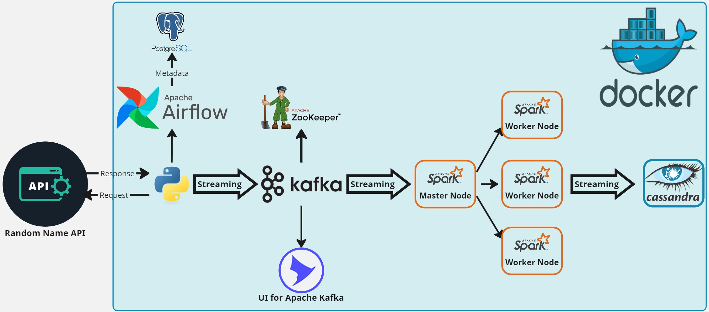
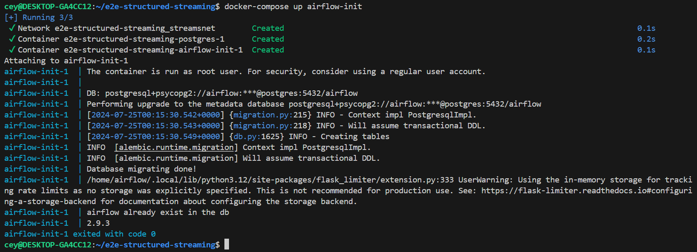
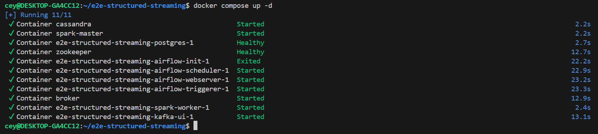
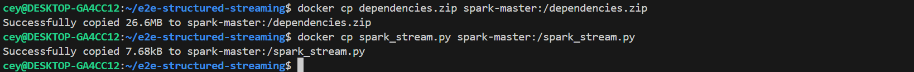
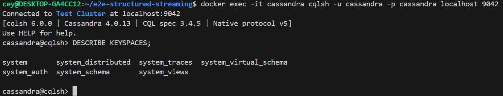
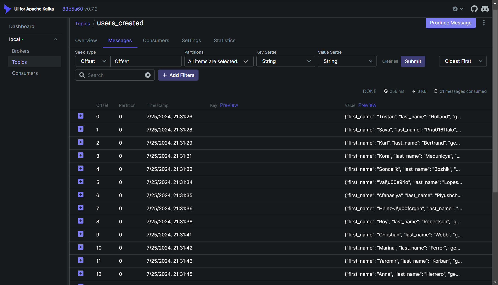
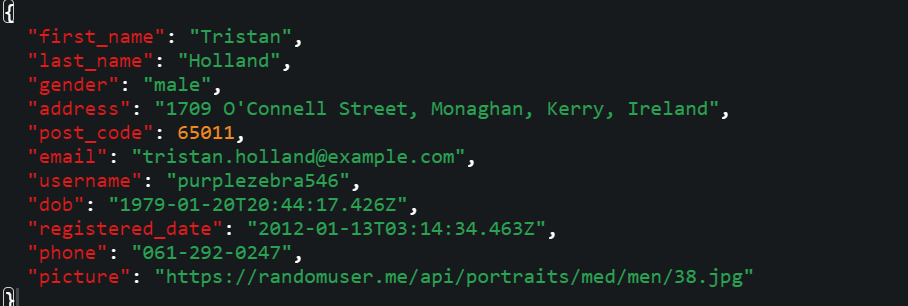
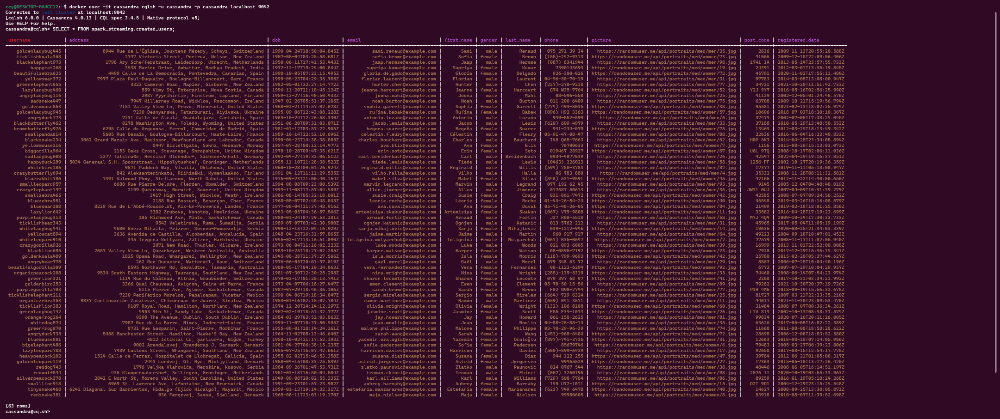
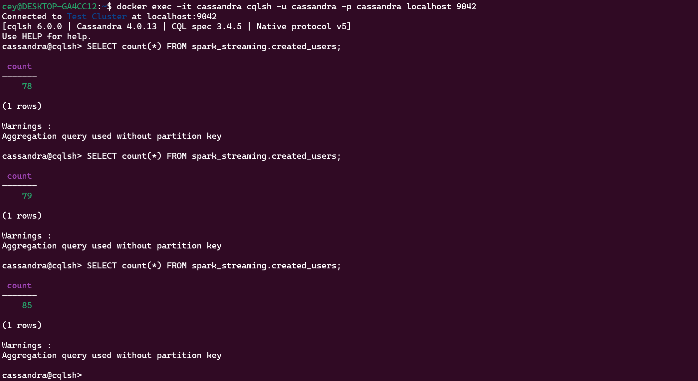

**This repository demonstrates a data engineering pipeline using Spark Structured Streaming. It retrieves random names from an API, sends the data to Kafka topics via Airflow, and processes it with Spark Structured Streaming before storing it in Cassandra.**

# System Architecture

## Components:

**Data Source:** Uses the randomuser.me API for generating user data. \
**Apache Airflow:** Orchestrates the pipeline and schedules data ingestion. \
**Apache Kafka & Zookeeper:** Stream data from PostgreSQL to Spark. \
**Apache Spark:** Processes data in real time. \
**Cassandra:** Stores the processed data. \
**Scripts:**

**kafka_stream.py:** Airflow DAG script that pushes API data to Kafka during 2 minutes every 1 seconds. \
**spark_stream.py:** Consumes and processes data from Kafka using Spark Structured Streaming. 

## What You'll Learn:

Setting up and orchestrating pipelines with Apache Airflow. \
Real-time data streaming with Apache Kafka. \
Synchronization with Apache Zookeeper. \
Data processing with Apache Spark. \
Storage solutions with Cassandra and PostgreSQL. \
Containerization of the entire setup using Docker. \
**Technologies:** \
Apache Airflow, Python, Apache Kafka, Apache Zookeeper, Apache Spark, Cassandra, PostgreSQL, Docker 

## Getting Started

### WebUI links

`Airflow`  : <http://localhost:8080/> \
`Kafka UI` : <http://localhost:8085/> \

### Clone the repository:

`$ git clone https://github.com/akarce/e2e-structured-streaming.git`

### Navigate to the project directory:

`$ cd e2e-structured-streaming`

### Create an .env file in project folder and set an AIRFLOW_UID

`$ echo -e "AIRFLOW_UID=$(id -u)" > .env`

`$ echo AIRFLOW_UID=50000 >> .env`

### Run Docker Compose to perform database migrations and create the first user account

`$ docker-compose up airflow-init`

### Run Docker Compose again to spin up the services:

`$ docker compose up -d`

### Copy the dependencies.zip and spark_stream.py files into spark-master container

`$ docker cp dependencies.zip spark-master:/dependencies.zip`

`$ docker cp spark_stream.py spark-master:/spark_stream.py`

### Run the docker exec command to access cqlsh shell in cassandra container 

`$ docker exec -it cassandra cqlsh -u cassandra -p cassandra localhost 9042`

### Run describe command to see there are no keyspaces named in cassandra instance

`cqlsh> DESCRIBE KEYSPACES;`

### Unpause the dag user_automation using Airflow UI

**Go to Airflow UI using :** <http://localhost:8080/>

**Login using** Username: `admin` Password: `admin`

**You can track the topic creation and message queue using the open source tool named UI for Apache Kafka that is running as a container, WebUI link:**  <http://localhost:8085/>

**Message schema looks like this**

### In a new terminal run the docker exec command to run spark job to read the streaming from kafka topic:

`$ docker exec -it spark-master spark-submit     --packages com.datastax.spark:spark-cassandra-connector_2.12:3.5.1,org.apache.spark:spark-sql-kafka-0-10_2.12:3.5.1     --py-files /dependencies.zip     /spark_stream.py`

### Now go back to the cqlsh shell terminal back and run the command to see data is inserted to cassandra table called created_users

`cqlsh> SELECT * FROM spark_streaming.created_users;`

#### and run count query several times to approve data is being inserted while running user_automation dag

`cqlsh> SELECT count(*) FROM spark_streaming.created_users;`

